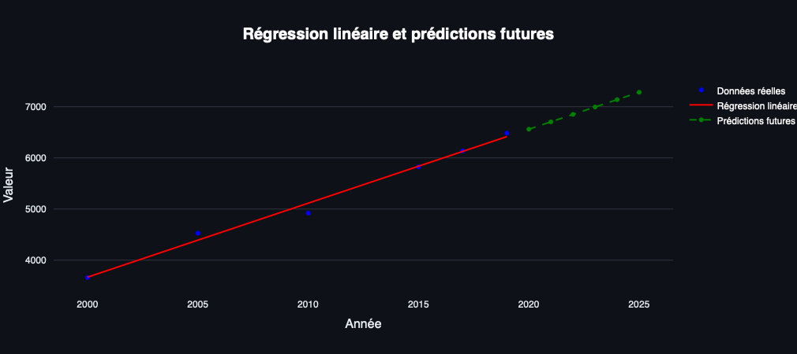
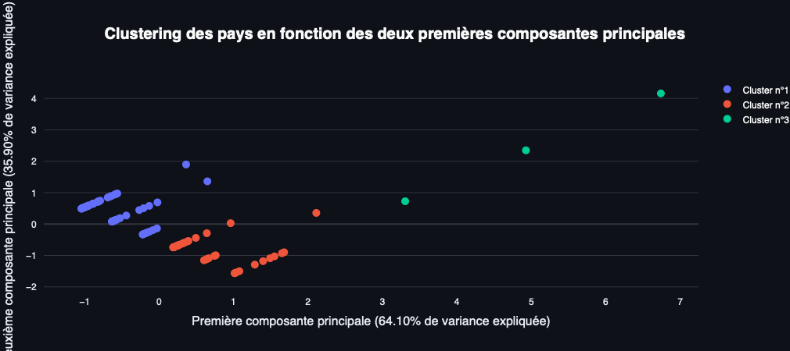

# **OpenData-Project**

## **Analyse des données de santé publique via l'API de l'OMS**

### **Développé par :**
- [Jonathan Duckes](https://github.com/jonathanduc)
- [Audric Girondin](https://github.com/aaudric)

---

## **Objectif du Projet**

Ce projet vise à développer une application web interactive utilisant **Streamlit** pour analyser et visualiser des données de santé publique fournies par l'**Organisation Mondiale de la Santé (OMS)**. L'application permet de récupérer dynamiquement des indicateurs de santé via l'API GHO de l'OMS, d'effectuer des analyses descriptives et des visualisations géographiques, et d'appliquer des techniques de machine learning telles que :

- **Régression linéaire** pour la prédiction des indicateurs.
- **Clustering (KMeans)** pour regrouper les pays en fonction de leurs performances.

L'objectif est de rendre les données de santé publique accessibles et compréhensibles via un tableau de bord visuel et interactif.

---

## **Fonctionnalités**

### **1. Accueil**

- Présentation du projet et des fonctionnalités principales.
- Intégration d'une vidéo explicative et d'images.
- Accès rapide à des liens vers les ressources (OMS, documentation Streamlit, etc.).

### **2. Analyse des Données**

- **Exploration interactive :**
  - Sélection d'un indicateur parmi ceux contenant "Health" dans leur nom.
  - Affichage des données brutes et descriptives.
  - Visualisations interactives (graphiques en barres et lignes) pour analyser l'évolution temporelle des indicateurs par pays.
- **Prétraitement des données :**
  - Suppression des valeurs manquantes.
  - Conversion des années en formats exploitables.
  - Filtrage des indicateurs pertinents avec valeurs numériques.

### **3. Visualisation Géographique**

- **Carte Choroplèthe Interactive :**
  - Créée avec **Plotly** pour représenter les indicateurs par pays.
  - Permet de visualiser les disparités géographiques.
- **Option GeoPandas :**
  - Carte statique avec des données agrégées par pays.

### **4. Machine Learning**

- **Régression Linéaire :**
  - Analyse des tendances des indicateurs en fonction du temps.
  - Prédiction des valeurs futures.
  - Affichage des métriques clés : coefficient, intercept, score R².
- **Clustering avec PCA :**
  - Réduction de dimension pour visualiser les clusters de pays.
  - Méthode du coude pour déterminer le nombre optimal de clusters.
  - Visualisation des clusters avec **Plotly**.

---

## **Données et Sources**

### **Source des Données**

Les données sont récupérées via l'**API GHO (Global Health Observatory)** de l'OMS. Elles incluent divers indicateurs de santé, tels que :

- Espérance de vie à la naissance.
- Taux de mortalité infantile.
- Prévalence des maladies non transmissibles.
- Accès aux services de santé.

Chaque indicateur est identifié par un code unique, avec des mesures par pays et par année.

### **Structure des Données**

- **Country (Pays)** : Nom du pays.
- **Continent** : Région parent.
- **Year (Année)** : Année de la mesure.
- **Value (Valeur)** : Valeur numérique associée à l'indicateur.

---

## **Technologies Utilisées**

- **[Python](https://www.python.org)** : Langage principal.
- **[Streamlit](https://streamlit.io/)** : Création de l'interface interactive.
- **[Plotly](https://plotly.com/)**: Visualisations interactives.
- **[GeoPandas](https://geopandas.org/)** : Manipulation et affichage de données géospatiales.
- **[Scikit-learn](https://scikit-learn.org/)**  : Modèles de machine learning.
- **[Pandas](https://pandas.pydata.org/)** : Manipulation de données.
- **[NumPy](https://numpy.org/)**: Calcul numérique.

---

## **Difficultés Rencontrées**

1. **Données Manquantes** :
   - Certains indicateurs ou années présentent des valeurs absentes.
   - Solutions : Filtrage et imputation des données.

2. **Performance** :
   - Temps de réponse parfois long lors de la récupération des données via l'API.
   - Solution : Limitation du nombre d'indicateurs à afficher.

3. **Interface Utilisateur** :
   - Création d'une interface intuitive et fluide.
   - Ajustements constants pour améliorer l'expérience utilisateur.

---

## **Améliorations Futures**

1. **Extension des Indicateurs** :
   - Ajouter plus d'indicateurs pour couvrir un éventail plus large de données.

2. **Optimisation des Algorithmes** :
   - Explorer des techniques avancées de machine learning.

3. **Actualisation Automatique** :
   - Mettre en place un système pour récupérer les données les plus récentes.

4. **Personnalisation** :
   - Offrir plus d'options pour personnaliser les visualisations et les analyses.

5. **Hébergement Cloud** :
   - Déploiement sur une plateforme cloud pour une meilleure accessibilité.

---

## **Lancement de l'Application**

1. Clonez le dépôt GitHub :
   ```bash
   git clone https://github.com/jonathanduc/OpenData-Project.git
    ```
2. Installez les dépendances requises :

    ```bash
    pip install -r requirements.txt
    ```

3. Exécutez l'application Streamlit :
   ```bash
   streamlit run mon_fichier.py
   ```
---
## **Ressources** :

- **[Streamlit Documentaion](https://streamlit.io/)** : Site officiel de Streamlit, une bibliothèque open-source pour la création d'applications web interactives avec Python.
- **[Plotly Documentation](https://plotly.com/)** : Site officiel de Plotly, une bibliothèque graphique pour la création de visualisations interactives.
- **[OMS - API GHO](https://www.who.int/data/gho)** : Site officiel de l'OMS, offrant un accès à l'API GHO pour les données de santé publique.


## **Annexe** : 
- **Page d'accueil:**
- **Page de analyse:**
- **Page Machine Learning:**



- **Page de visualisation géographique:**


---
En résumé, ce projet constitue une base solide pour l'analyse des données de santé publique en utilisant des outils modernes de data science et de développement web. Les améliorations futures permettront d'enrichir les fonctionnalités et d'étendre la portée de l'application, rendant l'outil encore plus utile pour les chercheurs, les décideurs et le grand public.
