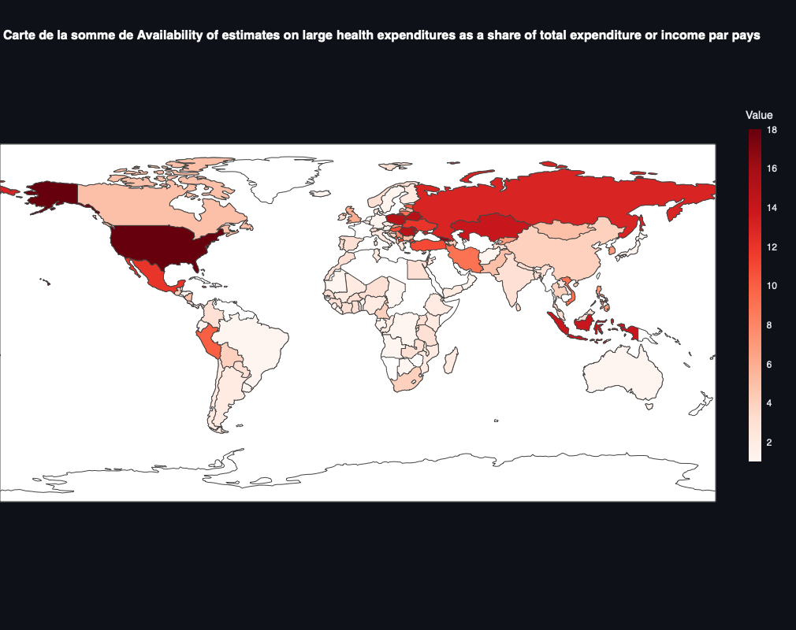

# OpenData-Project
# Livrable - Note Manuscrite

**Présenté par :**
- **[Jonathan Duckes](https://github.com/jonathanduc)**
- **[Audric Girondin](https://github.com/aaudric)**

**Projet : Analyse des données de santé publique - API de l’OMS**

---

## Objectif du Projet

Le projet vise à développer un tableau de bord interactif utilisant Streamlit pour analyser et visualiser des données de santé publique fournies par l'Organisation Mondiale de la Santé (OMS). En exploitant l'API de l'OMS, l'application permet de récupérer dynamiquement des indicateurs de santé, de réaliser des analyses descriptives et d'appliquer des techniques de machine learning telles que la régression linéaire et le clustering. L'objectif est de fournir un outil intuitif et fonctionnel facilitant la compréhension des tendances et des relations dans les données de santé mondiale.

## Présentation des Données

Les données proviennent de l'API GHO (Global Health Observatory) de l'OMS, offrant un accès à une vaste collection d'indicateurs de santé publique. Chaque indicateur est identifié par un code unique et contient des valeurs numériques par pays et par année. Les données couvrent divers aspects tels que l'espérance de vie, les taux de mortalité, la prévalence des maladies, et l'accès aux services de santé. L'application filtre les indicateurs contenant "Health" dans leur nom pour se concentrer sur des mesures pertinentes et significatives.

## Variables et Indicateurs Utilisés

### Quelques Indicateurs Sélectionnés

- **Espérance de vie à la naissance**
- **Taux de mortalité infantile**
- **Prévalence des maladies non transmissibles**
- **Accès aux services de santé**

### Variables Principales

- **Country (Pays)** : Identifie le pays concerné par les données.
- **Continent (Continent)** : Indique le continent auquel appartient le pays.
- **Year (Année)** : Année de la mesure de l'indicateur.
- **Value (Valeur)** : Valeur numérique de l'indicateur mesuré.

### Techniques de Machine Learning

- **Régression Linéaire** : Utilisée pour prédire les valeurs futures d'un indicateur en fonction du temps.
- **Clustering (KMeans)** : Employé pour regrouper les pays en fonction de leurs performances sur les indicateurs sélectionnés, en utilisant une réduction de dimension via PCA et une normalisation des données.

### Visualisation Géographique des Indicateurs de Santé

La page Visualisation Géographique permet aux utilisateurs d’explorer les données de santé publique sous forme de cartes. Grâce à la bibliothèque Plotly, une carte choroplèthe interactive est générée pour afficher la répartition géographique des indicateurs de santé. Les principales fonctionnalités de cette section incluent :

- **Affichage des Données Agrégées par Pays** : Les données sont groupées par pays pour chaque indicateur et affichées sur une carte pour une visualisation globale.
- **Carte Choroplèthe avec Plotly** : Une carte interactive met en évidence les pays en fonction de la valeur de l’indicateur sélectionné. L’intensité de la couleur augmente avec la valeur de l’indicateur, facilitant la compréhension des disparités géographiques.
- **Option pour Afficher une Carte avec GeoPandas** : En plus de la carte interactive Plotly, une option permet d’afficher les données avec GeoPandas pour une visualisation statique.

Cette carte géographique enrichit la compréhension des données en offrant une dimension visuelle intuitive, facilitant ainsi l’identification de tendances géospatiales dans les indicateurs de santé.

## Difficultés Rencontrées et Idées pour Aller Plus Loin

### Difficultés Rencontrées

1. **Gestion des Données Manquantes** : De nombreuses entrées contiennent des valeurs manquantes ou non disponibles, nécessitant des traitements spécifiques pour assurer la qualité des analyses.
2. **Performance de l'Application** : La récupération et le traitement en temps réel des données via l'API peuvent entraîner des temps de réponse lents, surtout avec un grand nombre d'indicateurs ou de pays.
3. **Visualisation des Modèles de Machine Learning** : Intégrer des visualisations interactives et compréhensibles pour les utilisateurs non techniques a été un défi, en particulier pour les graphiques de clustering et de régression.
4. **Interface Utilisateur** : Concevoir une interface intuitive et fluide avec Streamlit a nécessité des ajustements constants pour optimiser l'expérience utilisateur.

### Idées pour Aller Plus Loin

1. **Extension des Indicateurs** : Ajouter davantage d'indicateurs de santé pour enrichir l'analyse et offrir une vision plus complète des données de santé publique.
2. **Optimisation des Modèles de Machine Learning** : Explorer des algorithmes plus avancés et optimiser les paramètres des modèles existants pour améliorer les prédictions et la segmentation des clusters.
3. **Automatisation des Mises à Jour** : Mettre en place des mécanismes automatiques pour actualiser régulièrement les données depuis l'API, garantissant ainsi que le dashboard reflète toujours les informations les plus récentes.
4. **Personnalisation Avancée** : Permettre aux utilisateurs de personnaliser davantage les visualisations, tels que le choix des axes, des types de graphiques, et l'application de filtres avancés.
5. **Intégration de Cartes Géographiques** : Ajouter des visualisations géospatiales pour représenter les indicateurs de santé par localisation géographique, offrant une dimension supplémentaire à l'analyse.
6. **Déploiement sur le Cloud** : Héberger l'application sur une plateforme cloud pour améliorer l'accessibilité et la scalabilité, tout en assurant la sécurité des données.

En résumé, ce projet constitue une base solide pour l'analyse des données de santé publique en utilisant des outils modernes de data science et de développement web. Les améliorations futures permettront d'enrichir les fonctionnalités et d'étendre la portée de l'application, rendant l'outil encore plus utile pour les chercheurs, les décideurs et le grand public.

---
### Références

- **[Streamlit](https://streamlit.io/)** : Site officiel de Streamlit, une bibliothèque open-source pour la création d'applications web interactives avec Python.
- **[Plotly](https://plotly.com/)** : Site officiel de Plotly, une bibliothèque graphique pour la création de visualisations interactives.
- **[GeoPandas](https://geopandas.org/)** : Site officiel de GeoPandas, une extension de Pandas pour la manipulation de données géospatiales.
- **[OMS - API GHO](https://www.who.int/data/gho)** : Site officiel de l'OMS, offrant un accès à l'API GHO pour les données de santé publique.
- **[Scikit-learn](https://scikit-learn.org/)** : Site officiel de scikit-learn, une bibliothèque de machine learning pour Python.
- **[Matplotlib](https://matplotlib.org/)** : Site officiel de Matplotlib, une bibliothèque de visualisation de données pour Python.
- **[NumPy](https://numpy.org/)** : Site officiel de NumPy, une bibliothèque pour le calcul numérique en Python.
- **[Pandas](https://pandas.pydata.org/)** : Site officiel de Pandas, une bibliothèque pour la manipulation et l'analyse de données en Python.

### Annexe : 
- **Page d'accueil:**
- **Page de analyse:**
- **Page Machine Learning:**

- **Page de visualisation géographique:**

